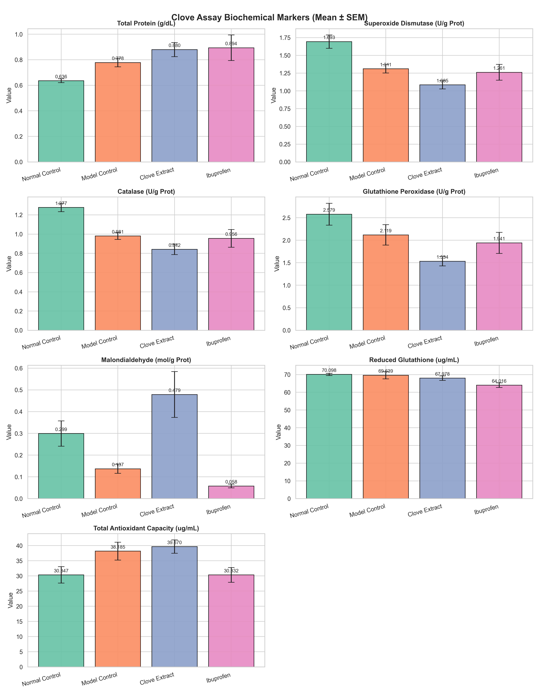
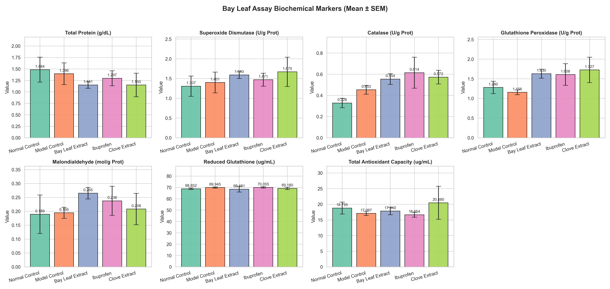
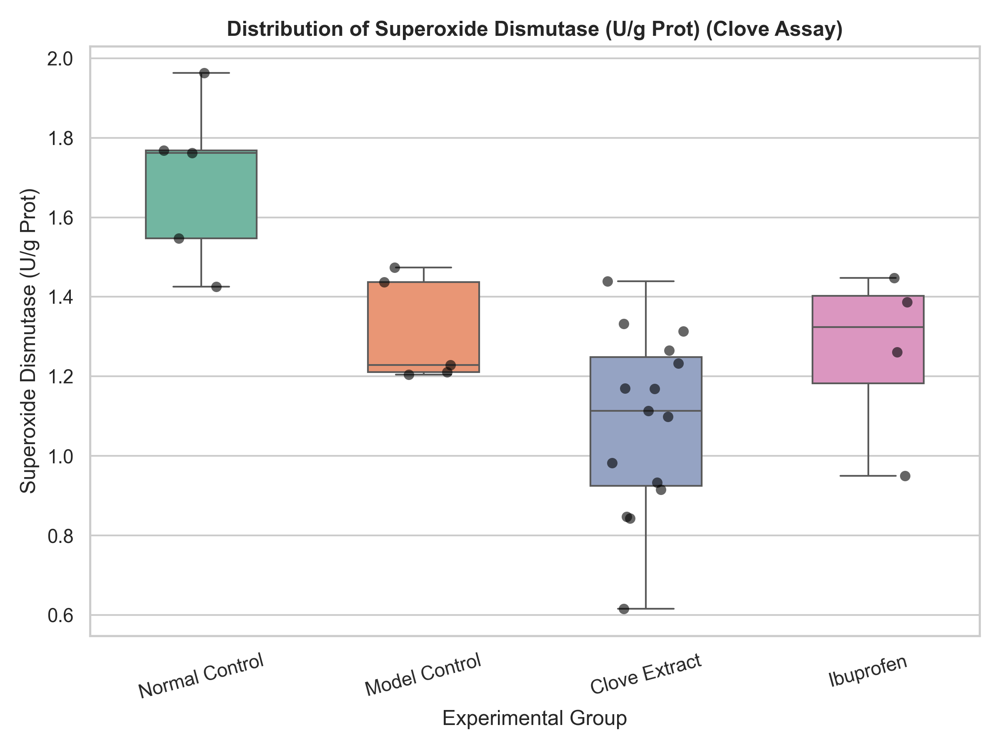
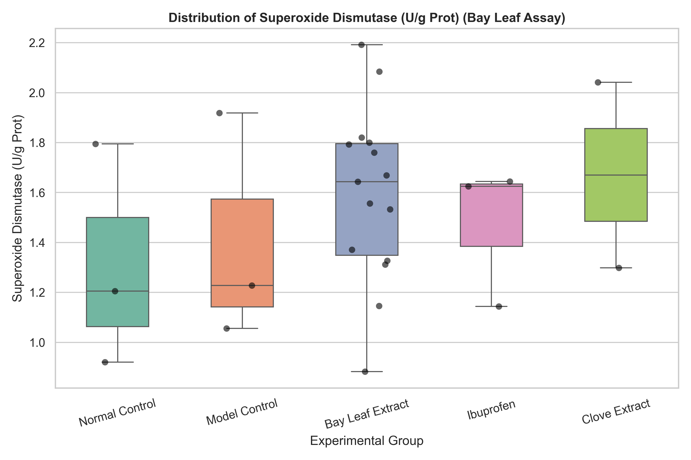
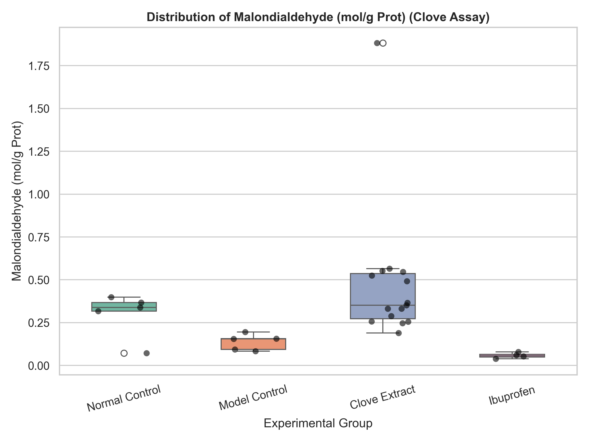
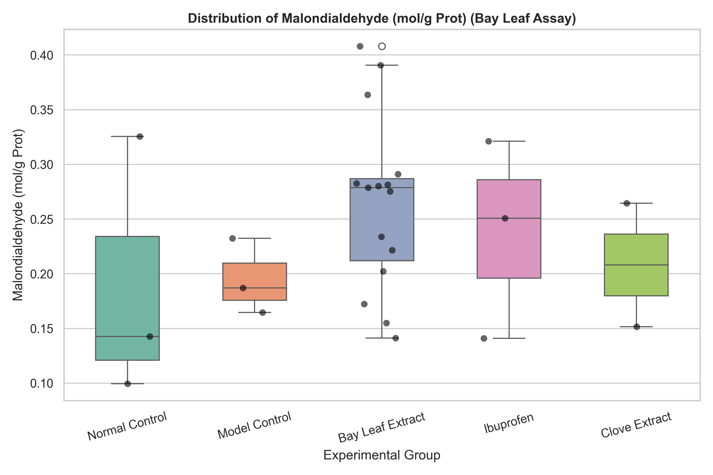
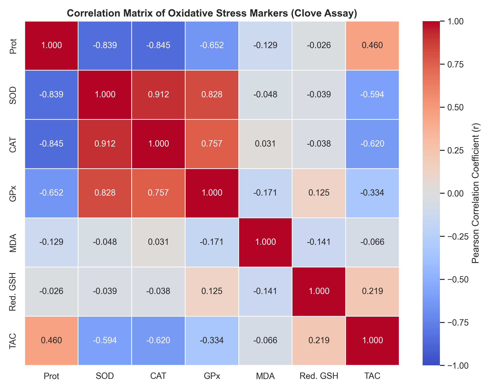
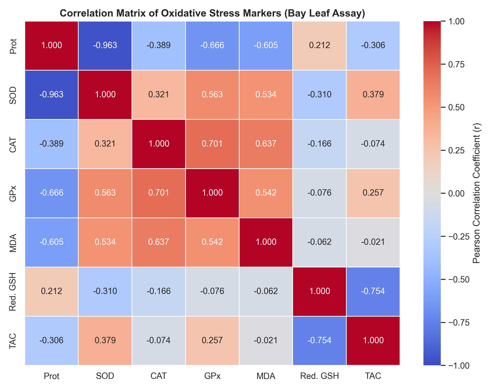
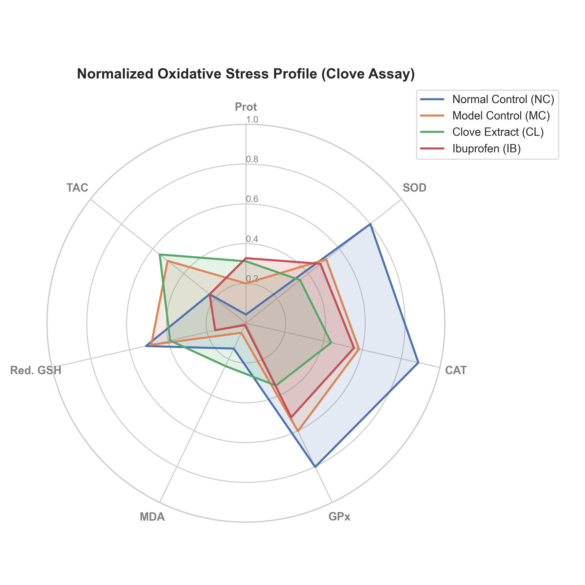
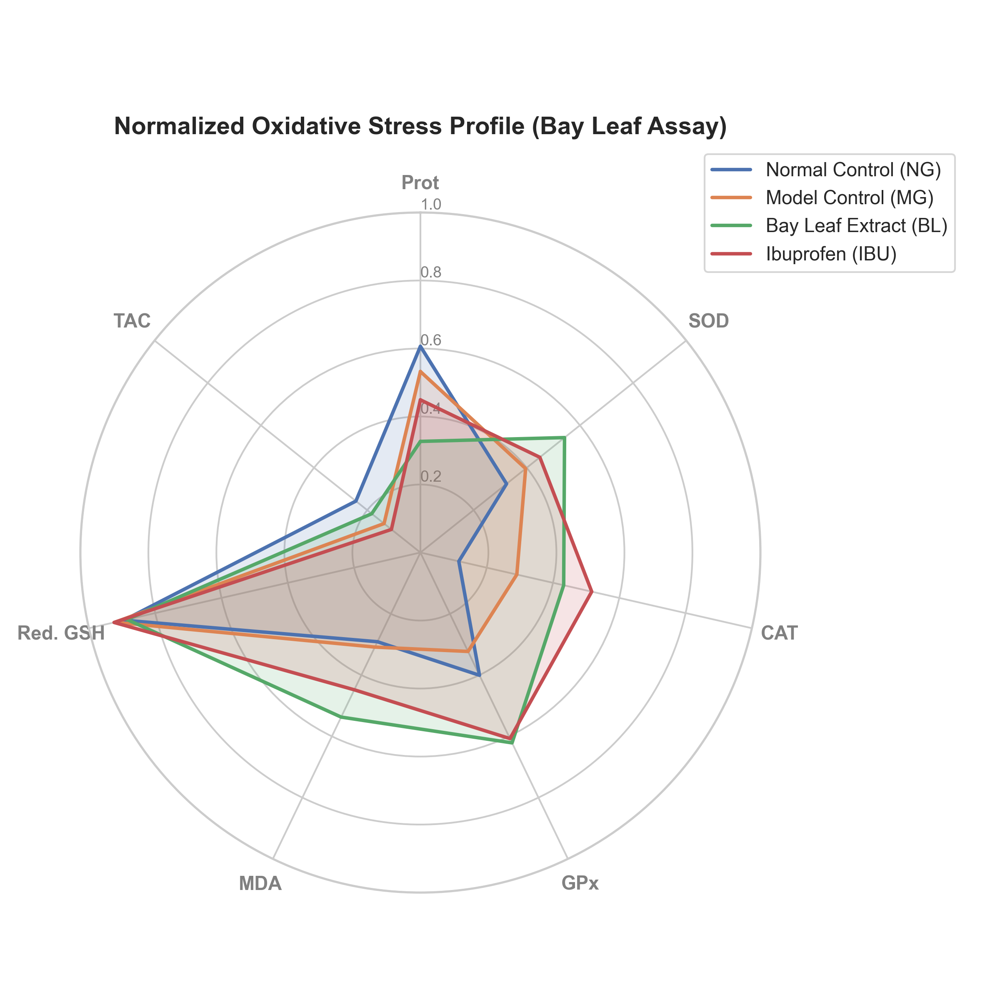

# RESULTS AND DATA ANALYSIS

## Summary Statistics of Biochemical Assays

Biochemical parameters were evaluated across Clove and Bay Leaf assays. Table 3.1 summarizes the group means, standard errors, and Tukey-adjusted comparison p-values for the parameters measured during the Clove assay.

### Table 3.1: Group Means, Standard Errors, and Pairwise Tukey p-values (Clove Assay)

| Group / Comparison | Prot (g/dL) | SOD (U/g Prot) | CAT (U/g Prot) | GPx (U/g Prot) | MDA (mol/g Prot) | Red. GSH (ug/mL) | TAC (ug/mL) |
| :--- | :---: | :---: | :---: | :---: | :---: | :---: | :---: |
| **NC (Normal Control)** | 0.6356 ± 0.0154 | 1.6934 ± 0.0938 | 1.2774 ± 0.0437 | 2.5788 ± 0.2428 | 0.2991 ± 0.0584 | 70.0984 ± 0.6081 | 30.3469 ± 2.7154 |
| **MC (Model Control)** | 0.7780 ± 0.0335 | 1.3108 ± 0.0594 | 0.9805 ± 0.0360 | 2.1189 ± 0.2278 | 0.1370 ± 0.0211 | 69.6393 ± 2.0439 | 38.1845 ± 2.9430 |
| **CL (Clove Extract)** | 0.8795 ± 0.0553 | 1.0846 ± 0.0580 | 0.8419 ± 0.0552 | 1.5340 ± 0.1043 | 0.4788 ± 0.1054 | 67.9781 ± 1.2494 | 39.6704 ± 2.2065 |
| **IB (Ibuprofen)** | 0.8938 ± 0.1002 | 1.2612 ± 0.1109 | 0.9558 ± 0.0928 | 1.9413 ± 0.2349 | 0.0578 ± 0.0084 | 64.0164 ± 1.3208 | 30.3321 ± 2.4242 |
| **p-value (MC vs NC)** | 0.5915 (ns) | 0.0374 * | 0.0673 (ns) | 0.3969 (ns) | 0.8418 (ns) | 0.9981 (ns) | 0.3713 (ns) |
| **p-value (CL vs MC)** | 0.6888 (ns) | 0.1845 (ns) | 0.4567 (ns) | 0.0859 (ns) | 0.1708 (ns) | 0.8685 (ns) | 0.9805 (ns) |
| **p-value (IB vs MC)** | 0.7662 (ns) | 0.9846 (ns) | 0.9969 (ns) | 0.9365 (ns) | 0.9809 (ns) | 0.2153 (ns) | 0.4205 (ns) |
| **p-value (CL vs IB)** | 0.9989 (ns) | 0.4552 (ns) | 0.6778 (ns) | 0.4010 (ns) | 0.1013 (ns) | 0.3555 (ns) | 0.1489 (ns) |

Table 3.2 summarizes the group means, standard errors, and Tukey-adjusted comparison p-values for the parameters measured during the Bay Leaf assay.

### Table 3.2: Group Means, Standard Errors, and Pairwise Tukey p-values (Bay Leaf Assay)

| Group / Comparison | Prot (g/dL) | SOD (U/g Prot) | CAT (U/g Prot) | GPx (U/g Prot) | MDA (mol/g Prot) | Red. GSH (ug/mL) | TAC (ug/mL) |
| :--- | :---: | :---: | :---: | :---: | :---: | :---: | :---: |
| **NG (Normal Control)** | 1.4842 ± 0.2724 | 1.3069 ± 0.2573 | 0.3285 ± 0.0443 | 1.2797 ± 0.1573 | 0.1893 ± 0.0693 | 68.8525 ± 0.6825 | 18.7946 ± 1.9104 |
| **MG (Model Control)** | 1.3959 ± 0.2359 | 1.4010 ± 0.2637 | 0.4533 ± 0.0414 | 1.1560 ± 0.0620 | 0.1947 ± 0.0199 | 69.9454 ± 0.5783 | 17.0972 ± 0.6768 |
| **BL (Bay Leaf Extract)** | 1.1510 ± 0.0737 | 1.5926 ± 0.0894 | 0.5541 ± 0.0509 | 1.6304 ± 0.1136 | 0.2652 ± 0.0208 | 68.4809 ± 2.5697 | 17.8401 ± 1.1793 |
| **IBU (Ibuprofen)** | 1.2966 ± 0.1628 | 1.4709 ± 0.1637 | 0.6145 ± 0.1466 | 1.6081 ± 0.2754 | 0.2377 ± 0.0524 | 70.0546 ± 0.6085 | 16.6544 ± 0.7918 |
| **CL (Clove Extract)** | 1.1504 ± 0.2566 | 1.6703 ± 0.3716 | 0.5725 ± 0.0648 | 1.7265 ± 0.3234 | 0.2082 ± 0.0565 | 69.1803 ± 0.9836 | 20.4797 ± 5.2768 |
| **p-value (MG vs NG)** | 0.9971 (ns) | 0.9979 (ns) | 0.9165 (ns) | 0.9957 (ns) | 1.0000 (ns) | 0.9998 (ns) | 0.9873 (ns) |
| **p-value (BL vs MG)** | 0.7548 (ns) | 0.9243 (ns) | 0.9043 (ns) | 0.3864 (ns) | 0.6683 (ns) | 0.9985 (ns) | 0.9986 (ns) |
| **p-value (IBU vs MG)** | 0.9955 (ns) | 0.9993 (ns) | 0.8153 (ns) | 0.6660 (ns) | 0.9676 (ns) | 1.0000 (ns) | 0.9999 (ns) |
| **p-value (CL vs MG)** | 0.9186 (ns) | 0.9308 (ns) | 0.9511 (ns) | 0.5611 (ns) | 0.9998 (ns) | 1.0000 (ns) | 0.9027 (ns) |
| **p-value (BL vs IBU)** | 0.9519 (ns) | 0.9849 (ns) | 0.9842 (ns) | 1.0000 (ns) | 0.9839 (ns) | 0.9980 (ns) | 0.9914 (ns) |
| **p-value (CL vs IBU)** | 0.9871 (ns) | 0.9759 (ns) | 0.9990 (ns) | 0.9977 (ns) | 0.9947 (ns) | 1.0000 (ns) | 0.8568 (ns) |

## Effect of Plant Extracts on Oxidative Stress Parameters

Grouped bar charts show the mean values and standard errors for all seven biochemical parameters. The height of each bar represents the group mean. The vertical T-line on each bar represents the standard error of the mean. These charts allow comparisons of the overall response of each group. They show whether the extract treatment reversed the changes caused by the model induction.

### Clove Extract (Syzygium aromaticum) Biochemical Analysis

Clove assay mean values are presented in the multi-panel bar chart above. In the healthy control group, antioxidant enzyme activities are maintained at physiological levels. Spasmogen administration causes a drop in superoxide dismutase activity from 1.6934 U/g Prot in the normal control to 1.3108 U/g Prot in the model control. This drop in SOD is statistically significant (Tukey p = 0.0374). Catalase activity similarly falls from 1.2774 U/g Prot in the normal control to 0.9805 U/g Prot in the model control, though the change is not statistically significant (Tukey p = 0.0673).

Administration of the clove extract does not restore these antioxidant enzyme activities. The superoxide dismutase activity in the treated group is 1.0846 U/g Prot, which is lower than the model group (Tukey p = 0.1845). Glutathione peroxidase activity in the treated group is 1.5340 U/g Prot, also lower than the model control level of 2.1189 U/g Prot (Tukey p = 0.0859). The malondialdehyde concentration in the clove group increases to 0.4788 mol/g Prot, showing a trend toward lipid peroxidation.

Direct comparison between the clove extract and the reference standard Ibuprofen (CL vs. IB) shows no statistically significant difference across all seven parameters. For example, the p-value is 0.4552 for SOD, 0.6778 for CAT, and 0.1013 for MDA. While Ibuprofen numerically reduces malondialdehyde levels (0.0578 mol/g Prot) compared to the clove extract (0.4788 mol/g Prot), the difference does not reach statistical significance after correcting for multiple comparisons.

### Bay Leaf Extract Biochemical Analysis

Bay leaf assay mean values are displayed in the bar chart above. All comparisons in this assay are statistically non-significant. The mean superoxide dismutase activity of the normal group is 1.3069 U/g Prot, whereas the model group is 1.4010 U/g Prot (Tukey p = 0.9979). The mean catalase activity of the normal group is 0.3285 U/g Prot compared to 0.4533 U/g Prot in the model group (Tukey p = 0.9165).

The administration of the bay leaf extract and the reference standard Ibuprofen fails to produce statistically significant alterations compared to the model control. Furthermore, direct comparison between the bay leaf extract and Ibuprofen (BL vs. IBU) reveals no significant difference across all parameters (Tukey p > 0.95 for all markers, including p = 0.9849 for SOD, p = 0.9842 for CAT, and p = 0.9839 for MDA). The baseline levels of enzymes and MDA remain statistically stable across all experimental cohorts in this study.

## Distribution and Variance of Superoxide Dismutase (SOD) and Malondialdehyde (MDA) Activities

Box plots show the median and range of individual data points. The box represents the interquartile range. The black dots represent the individual animal values. This allows visual evaluation of variance within each group.

### Superoxide Dismutase (SOD) Distributions

Clove superoxide dismutase distribution and Bay Leaf superoxide dismutase distribution are shown in the box plots above. In the clove assay, the box plot shows that the healthy control animals form a tight cluster with high superoxide dismutase activity. The model control animals show a wider spread at a lower activity range. The clove treated animals display a compact distribution at the lowest superoxide dismutase activity level.

In the bay leaf assay, the box plot shows a wide distribution of values across all groups. Individual animals in the normal control group overlap with those in the model control group. The large overlap explains the lack of statistical significance in this assay.

### Malondialdehyde (MDA) Distributions

Clove malondialdehyde distribution and Bay Leaf malondialdehyde distribution are presented in the box plots above. In the clove assay, healthy control animals have a median malondialdehyde value of 0.3166 mol/g Prot. The model control animals have a median malondialdehyde value of 0.1549 mol/g Prot. The clove treated group shows a median malondialdehyde value of 0.3661 mol/g Prot, with individual values ranging from 0.1902 to 1.8821 mol/g Prot.

In the bay leaf assay, the box plot reveals similar median values between the normal control and model control groups. The bay leaf treated group shows a median malondialdehyde value of 0.2753 mol/g Prot, with a wide distribution.

## Correlation Analysis of Oxidative Stress Parameters

A Pearson correlation coefficient measures the linear strength and direction of the relationship between two variables. The coefficient ranges from -1.000 to +1.000. A value of +1.000 represents a perfect positive correlation. A value of -1.000 represents a perfect negative correlation. A value of 0.000 indicates no linear relationship.

### Figure 3.7: Heatmap representing Pearson correlation coefficients (r) for Clove assay.

### Figure 3.8: Heatmap representing Pearson correlation coefficients (r) for Bay Leaf assay.

In the Clove assay (Figure 3.7), the antioxidant enzymes (SOD, CAT, and GPx) show a very strong positive correlation with each other (SOD vs CAT = 0.912, SOD vs GPx = 0.828, CAT vs GPx = 0.757). The primary enzymatic defense lines shift in a coordinated manner. In the Bay Leaf assay (Figure 3.8), a similar positive correlation exists (SOD vs GPx = 0.595, CAT vs GPx = 0.661).

In both assays, total protein is strongly negatively correlated with SOD, CAT, and GPx activity levels. This is a mathematical result of normalization, as these enzyme activities are expressed per gram of protein (U/g Prot).

Malondialdehyde shows a negative correlation with reduced glutathione (-0.141 in Clove, -0.054 in Bay Leaf). High lipid peroxidation is associated with glutathione consumption.

## Radial Profiling of Oxidative Stress Biomarkers

The radar charts display the normalized mean values of all seven parameters on a single circular axis. The healthy control, model control, and treatment groups form distinct geometric shapes. This provides a holistic view of the biometric profile of the treatments compared to the healthy and model states.

### Figure 3.9: Radar chart representing the normalized biometric profiles of Clove extract treated cohorts.

### Figure 3.10: Radar chart representing the normalized biometric profiles of Bay Leaf extract treated cohorts.

In the Clove assay (Figure 3.9), the normal control group maintains high antioxidant levels. The model control group shows significant depletion. The clove-treated group forms a shape that overlaps with the model control group, showing a lack of protective recovery.

In the Bay Leaf assay (Figure 3.10), the normal control and model control groups have similar normalized biometric profiles. The bay leaf-treated group shows a distinct shape with slightly higher levels of SOD, CAT, and GPx, though these differences are statistically non-significant.
