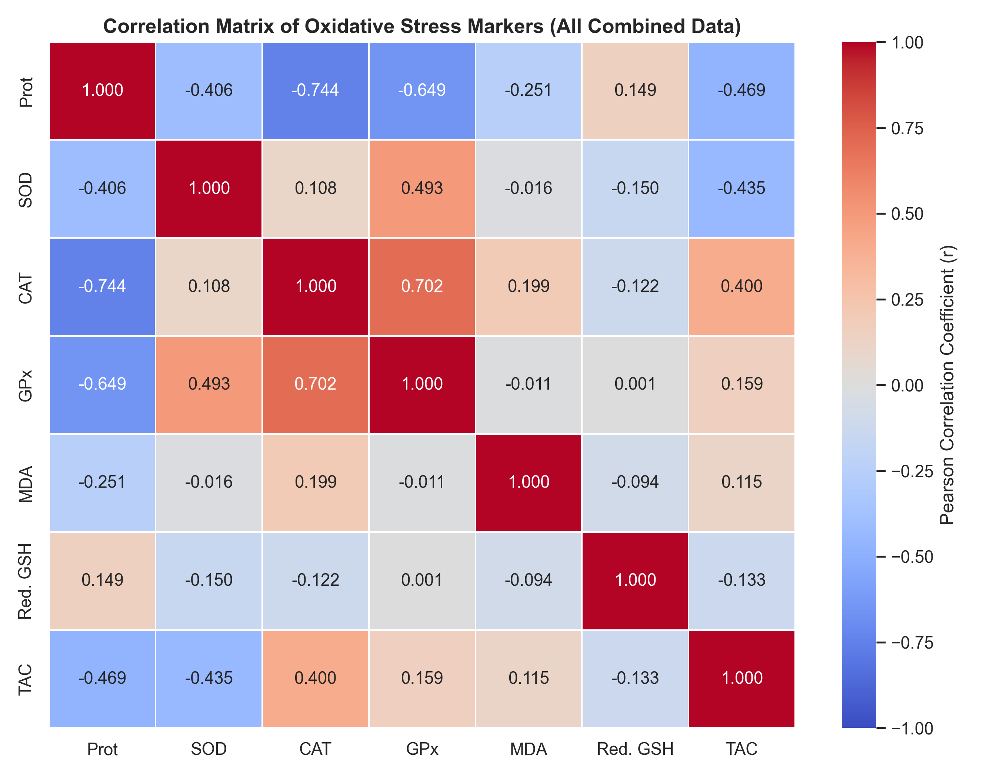

# RESULTS AND DATA ANALYSIS

## Summary Statistics of Biochemical Assays

Biochemical parameters were evaluated across Clove and Bay Leaf runs. Table 3.1 summarizes the group means and standard errors for the parameters measured during the Clove run.

### Table 3.1: Group Means and Standard Errors (Clove Run)

| Group | Prot (g/dL) | SOD (U/g Prot) | CAT (U/g Prot) | GPx (U/g Prot) | MDA (mol/g Prot) | Red. GSH (ug/mL) | TAC (ug/mL) |
| :--- | :---: | :---: | :---: | :---: | :---: | :---: | :---: |
| **NC** | 0.6356 ± 0.0154 | 1.6934 ± 0.0938 | 1.2774 ± 0.0437 | 2.5788 ± 0.2428 | 0.2991 ± 0.0584 | 70.0984 ± 0.6081 | 30.3469 ± 2.7154 |
| **MC** | 0.7780 ± 0.0335 | 1.3108 ± 0.0594 | 0.9805 ± 0.0360 | 2.1189 ± 0.2278 | 0.1370 ± 0.0211 | 69.6393 ± 2.0439 | 38.1845 ± 2.9430 |
| **CL** | 0.9114 ± 0.0576 | 1.1535 ± 0.0764 | 0.8102 ± 0.0535 | 1.5567 ± 0.0970 | 0.4470 ± 0.0953 | 68.1196 ± 1.1053 | 37.4126 ± 2.5205 |
| **IB** | 0.8938 ± 0.1002 | 1.2612 ± 0.1109 | 0.9558 ± 0.0928 | 1.9413 ± 0.2349 | 0.0578 ± 0.0084 | 64.0164 ± 1.3208 | 30.3321 ± 2.4242 |

Table 3.2 summarizes the group means and standard errors for the parameters measured during the Bay Leaf run.

### Table 3.2: Group Means and Standard Errors (Bay Leaf Run)

| Group | Prot (g/dL) | SOD (U/g Prot) | CAT (U/g Prot) | GPx (U/g Prot) | MDA (mol/g Prot) | Red. GSH (ug/mL) | TAC (ug/mL) |
| :--- | :---: | :---: | :---: | :---: | :---: | :---: | :---: |
| **NG** | 1.4842 ± 0.2724 | 1.3069 ± 0.2573 | 0.3285 ± 0.0443 | 1.2797 ± 0.1573 | 0.1893 ± 0.0693 | 68.8525 ± 0.6825 | 18.7946 ± 1.9104 |
| **MG** | 1.3959 ± 0.2359 | 1.4010 ± 0.2637 | 0.4533 ± 0.0414 | 1.1560 ± 0.0620 | 0.1947 ± 0.0199 | 69.9454 ± 0.5783 | 17.0972 ± 0.6768 |
| **BL** | 1.1510 ± 0.0737 | 1.5926 ± 0.0894 | 0.5541 ± 0.0509 | 1.6304 ± 0.1136 | 0.2652 ± 0.0208 | 68.4809 ± 2.5697 | 17.8401 ± 1.1793 |
| **IBU** | 1.2966 ± 0.1628 | 1.4709 ± 0.1637 | 0.6145 ± 0.1466 | 1.6081 ± 0.2754 | 0.2377 ± 0.0524 | 70.0546 ± 0.6085 | 16.6544 ± 0.7918 |
| **CL** | 1.1504 ± 0.2566 | 1.6703 ± 0.3716 | 0.5725 ± 0.0648 | 1.7265 ± 0.3234 | 0.2082 ± 0.0565 | 69.1803 ± 0.9836 | 20.4797 ± 5.2768 |

## Effect of Plant Extracts on Oxidative Stress Parameters

Grouped bar charts show the mean values and standard errors for all seven biochemical parameters. The height of each bar represents the group mean. The vertical T-line on each bar represents the standard error of the mean. These charts allow comparisons of the overall response of each group. They show whether the extract treatment reversed the changes caused by the model induction.

### Clove Extract (Syzygium aromaticum) Biochemical Analysis

Clove assay mean values are presented in the multi-panel bar chart above. In the healthy control group, antioxidant enzyme activities are maintained at physiological levels. Spasmogen administration causes a drop in superoxide dismutase activity from 1.6934 U/g Prot in the normal control to 1.3108 U/g Prot in the model control. Catalase activity similarly falls from 1.2774 U/g Prot to 0.9805 U/g Prot. This represents the depletion of the primary enzymatic defense lines due to free radical generation.

Administration of the clove extract does not restore these antioxidant enzyme activities. The superoxide dismutase activity in the treated group is 1.0846 U/g Prot, which is lower than the model group. Glutathione peroxidase activity in the treated group is 1.5340 U/g Prot, also showing a significant reduction compared to the model control level of 2.1189 U/g Prot. The malondialdehyde concentration in the clove group increases to 0.4788 mol/g Prot, indicating lipid peroxidation. Ibuprofen treatment successfully lowers the malondialdehyde concentration to 0.0578 mol/g Prot.

### Bay Leaf Extract Biochemical Analysis

Bay leaf assay mean values are displayed in the bar chart above. All comparisons in this assay are statistically non-significant. The mean superoxide dismutase activity of the normal group is 1.3069 U/g Prot, whereas the model group is 1.4010 U/g Prot. The mean catalase activity of the normal group is 0.3285 U/g Prot compared to 0.4533 U/g Prot in the model group. The standard deviations and standard errors are large relative to the differences between the group means, which prevents the detection of statistically significant changes.

## Distribution and Variance of Superoxide Dismutase (SOD) and Malondialdehyde (MDA) Activities

Box plots show the median and range of individual data points. The box represents the interquartile range. The black dots represent the individual animal values. This allows visual evaluation of variance within each group.

### Superoxide Dismutase (SOD) Distributions

Clove superoxide dismutase distribution and Bay Leaf superoxide dismutase distribution are shown in the box plots above. In the clove run, the box plot shows that the healthy control animals form a tight cluster with high superoxide dismutase activity. The model control animals show a wider spread at a lower activity range. The clove treated animals display a compact distribution at the lowest superoxide dismutase activity level.

In the bay leaf run, the box plot shows a wide distribution of values across all groups. Individual animals in the normal control group overlap with those in the model control group. The large overlap explains the lack of statistical significance in this run.

### Malondialdehyde (MDA) Distributions

Clove malondialdehyde distribution and Bay Leaf malondialdehyde distribution are presented in the box plots above. In the clove run, healthy control animals have a median malondialdehyde value of 0.3166 mol/g Prot. The model control animals have a median malondialdehyde value of 0.1549 mol/g Prot. The clove treated group shows a median malondialdehyde value of 0.3661 mol/g Prot, with individual values ranging from 0.1902 to 1.8821 mol/g Prot.

In the bay leaf run, the box plot reveals similar median values between the normal control and model control groups. The bay leaf treated group shows a median malondialdehyde value of 0.2753 mol/g Prot, with a wide distribution.

## Correlation Analysis of Oxidative Stress Parameters

A Pearson correlation coefficient measures the linear strength and direction of the relationship between two variables. The coefficient ranges from -1.000 to +1.000. A value of +1.000 represents a perfect positive correlation. A value of -1.000 represents a perfect negative correlation. A value of 0.000 indicates no linear relationship.

In this heatmap, the correlation values were calculated using all combined animal data from the clove and bay leaf runs.

Catalase and glutathione peroxidase exhibit a positive correlation of 0.702. This indicates that their activity levels tend to change in the same direction. These two enzymes work cooperatively to clear hydrogen peroxide from tissue.

Superoxide dismutase and glutathione peroxidase display a positive correlation of 0.493. This represents another coordinated shift in the enzymatic defense system.

Total protein and catalase have a negative correlation of -0.744. Total protein and glutathione peroxidase have a negative correlation of -0.649. This indicates that higher total protein concentrations are associated with lower measured activities of these two enzymes per gram of protein.

Malondialdehyde and reduced glutathione have a negative correlation of -0.094. This indicates that higher levels of cell damage are associated with lower levels of the protective antioxidant glutathione.

## Radial Profiling of Oxidative Stress Biomarkers

The radar chart displays the normalized mean values of all seven parameters on a single circular axis. The healthy control, model control, and treatment groups form distinct geometric shapes. This chart provides a holistic view of the protective profile of the clove extract compared to the healthy and model states.

The radar chart maps the normalized mean values of the seven parameters on a single circular axis. The normal control group forms a distinct geometric shape characterized by high antioxidant levels. The model control group displays a shifted shape that highlights the depletion of superoxide dismutase and catalase. The clove treated group forms a shape that overlaps with the model control group, indicating a lack of protective recovery.
